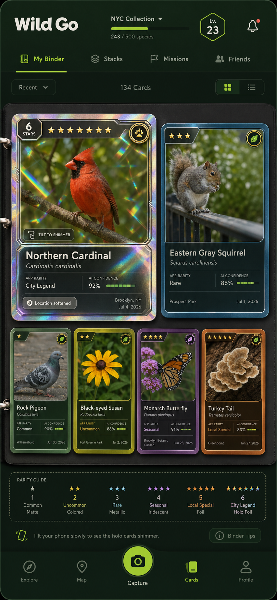
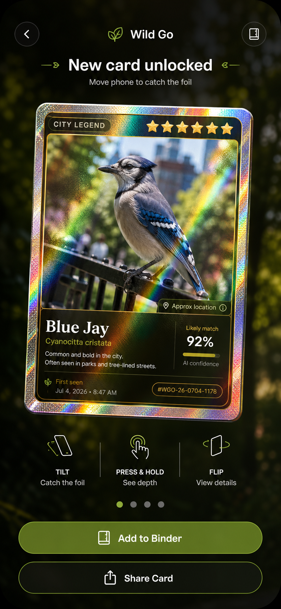
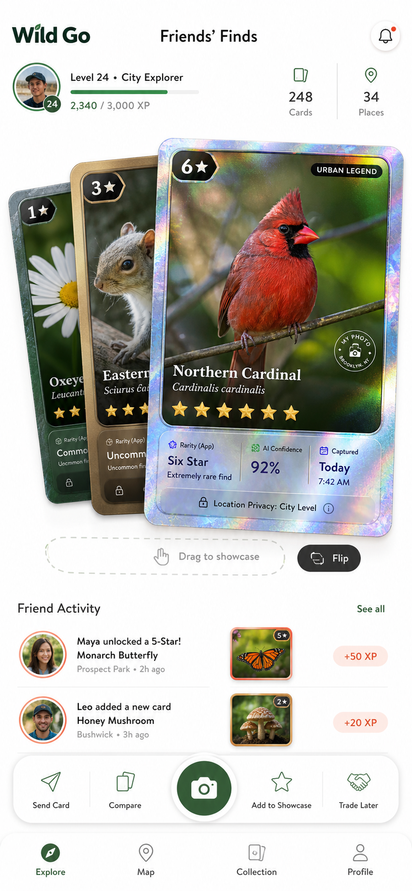

# Wild Go MVP Handoff

## Project Summary

Wild Go is a mobile-first prototype for a real-world urban nature collection app. Users photograph nearby plants and animals, receive AI-assisted identification, and collect each discovery as an original rarity card built from their own photos.

The MVP combines three confirmed product directions:

1. **Foil Reveal Capture**: the post-capture moment turns a finding into a six-star holographic card.
2. **Urban Card Binder**: every collected organism lives in a card binder with visible rarity tiers.
3. **Card Stack Social**: friend activity and sharing use physical-feeling card stacks instead of a generic social feed.

## Current Prototype

Local app path:

```text
wild-go-mvp/
```

Local dev URL while running:

```text
http://127.0.0.1:5173
```

Core files:

```text
src/App.jsx
src/styles.css
public/assets/
docs/card-visuals/
ios/App/App.xcodeproj
supabase/
design-qa.md
qa-shots/
```

## Card Visual References

These three source visuals are the canonical card-system direction for the MVP:

| Visual | File | Role |
| --- | --- | --- |
| Binder rarity grid | [`docs/card-visuals/binder-rarity-grid.png`](./docs/card-visuals/binder-rarity-grid.png) | Collection view showing the full binder, card scale hierarchy, and rarity guide. |
| Capture holo unlock | [`docs/card-visuals/capture-holo-unlock.png`](./docs/card-visuals/capture-holo-unlock.png) | Post-capture reveal for the most exciting moment: a six-star holographic card unlock. |
| Friends showcase stack | [`docs/card-visuals/friends-showcase-stack.png`](./docs/card-visuals/friends-showcase-stack.png) | Social/share direction using draggable physical card stacks instead of a generic feed. |







Card visual rules from these references:

- Every organism photo becomes a collectible card, not a plain observation tile.
- Rarity must be visible directly from the card face through star count, border material, label, finish, and accent color.
- Six stars is the maximum rarity and should read as a holographic/foil chase card.
- Lower rarities should still feel collectible: 1-star matte, 2-star colored, 3-star metallic, 4-star iridescent, 5-star foil, 6-star holo foil.
- Cards should support physical interactions: tilt to shimmer, press for depth, flip for details, drag/showcase for social use.
- Rarity is app discovery difficulty, not conservation status.

Implementation note: card physics and material should use existing MIT-licensed GitHub packages rather than custom one-off math:

- [`react-parallax-tilt`](https://github.com/mkosir/react-parallax-tilt) handles pointer/touch tilt, perspective, glare, and gyroscope support.
- [`Sticker`](https://github.com/bpisano/Sticker) is wired into the native SwiftUI target as an SPM dependency for Pokemon-style Metal foil shaders and motion-driven shimmer. Native foil art now uses Sticker-driven border, card-surface, and constrained spectral photo layers with the package README's example shader parameters instead of hand-written gradient art. On iOS 18+, Sticker shaders are precompiled on launch.

## What Is Implemented

- Mobile-first Vite + React prototype retained for design comparison.
- Native SwiftUI iOS shell that builds and runs in the iPhone simulator.
- SwiftData local persistence, AVFoundation camera preview and still capture, PhotosUI import, MapKit location views, and CoreLocation capture metadata.
- Captured/imported JPEGs are normalized, saved under the app support `ObservationPhotos` folder, and referenced by SwiftData cards so newly identified observations use the user's photo instead of a static demo asset.
- Cloud-first species recognition through the Supabase Edge Function, with Supabase Auth-verified signed-in user tokens, private Storage upload, and Postgres observation persistence.
- Edge Function cloud-recognition output is normalized before persistence so generous model responses still become card-safe rarity, finish, stars, confidence, notes, and alternative matches.
- Supabase Auth sessions persist the refresh token and expiry time; capture/import recognition and Profile collection sync refresh stale access tokens before sending signed-in cloud requests.
- Signed-in collection sync now uploads local-only SwiftData card photos to private Storage when the app still has the local JPEG, pushes card metadata to Postgres, pulls the user's cloud observations back into SwiftData, and caches private Storage images locally when the authenticated download succeeds.
- Vision/Core ML local recognition is wired through `VNCoreMLRequest`. `ios/ml/build-model.sh` trains (Create ML), compiles, and installs `WildGoSpeciesClassifier.mlmodelc` into the bundled `GeneratedAssets/` folder; `LocalSpeciesRecognizer` auto-discovers it there to enable local fallback/offline classification without any Xcode target edits.
- Camera capture is Simulator-hardened: `CameraSession` skips configuration on Simulator, waits briefly for a ready photo connection on device, and prevents overlapping captures, so `Add to Binder` reliably uses the demo fallback when no hardware capture is available.
- Restored iOS AppIcon asset catalog and LaunchScreen storyboard build resources.
- Six-star holographic unlock card for the capture result.
- Creature cards using bitmap nature photo assets, including a target-matched rock pigeon card crop.
- Visible rarity system from 1 to 6 stars.
- Rarity is treated as app discovery difficulty, not conservation status.
- Distinct card finishes:
  - 1 star: common matte
  - 2 stars: uncommon colored
  - 3 stars: rare metallic
  - 4 stars: seasonal iridescent
  - 5 stars: local special foil
  - 6 stars: city legend holo foil
- Card interactions:
  - pointer/touch tilt shimmer
  - opt-in device-orientation foil movement on supported phones
  - press depth
  - flip to card back with field notes, habitat, privacy, and wildlife guidance
  - add-to-binder state
  - simulator-safe add-to-binder fallback when AVFoundation has no active photo video connection
  - rarity filtering
  - social showcase toggle with a visible drop/showcase slot and a flippable showcase card back
- Bottom navigation:
  - Explore
  - Map
  - Capture
  - Cards
  - Profile
- Wildlife/privacy copy:
  - approximate location
  - location softened
  - rarity is discovery difficulty

## Validation

Commands run:

```bash
npm install
npm run build
deno check supabase/functions/identify-species/index.ts
npm run supabase:test
plutil -lint ios/App/App/Info.plist
npm run ios:build
npm run ios:verify-events
npm run ios:smoke
npm run ios:interactions
xcrun simctl install booted ios/App/build-native/Build/Products/Debug-iphonesimulator/App.app
xcrun simctl launch booted com.wildgo.mvp --wildgo-tab binder
xcrun simctl launch booted com.wildgo.mvp --wildgo-tab capture
```

QA artifacts:

```text
design-qa.md
public/assets/wild-go-combo-target.png
qa-shots/ios-simulator-final-compact.png
qa-shots/ios-simulator-final-material.png
qa-shots/interaction-binder-smoke.png
qa-shots/interaction-capture-smoke.png
qa-shots/interaction-profile-smoke.png
qa-shots/material-capture.png
qa-shots/material-cards.png
qa-shots/material-friends-stack.png
qa-shots/swiftui-native-binder-sticker-foil-v3.png
qa-shots/swiftui-native-binder-v7.png
qa-shots/swiftui-native-binder-grid-layout-final.png
qa-shots/swiftui-native-binder-list-interaction-v1.png
qa-shots/swiftui-native-binder-sort-rarity-v1.png
qa-shots/swiftui-native-capture-sticker-foil-v3.png
qa-shots/swiftui-native-capture-sticker-example-params-v1.png
qa-shots/swiftui-native-capture-holo-texture-v6.png
qa-shots/swiftui-native-capture-layout-final.png
qa-shots/swiftui-native-capture-back-layout-final.png
qa-shots/swiftui-native-capture-photo-pipeline-v1.png
qa-shots/swiftui-native-capture-card-back-v1.png
qa-shots/swiftui-native-capture-depth-card-back-v1.png
qa-shots/swiftui-native-capture-flip-back-v2.png
qa-shots/swiftui-native-capture-depth-button-v2.png
qa-shots/swiftui-native-capture-add-to-binder-v2.png
qa-shots/swiftui-native-capture-share-sheet-v2.png
qa-shots/swiftui-native-capture-tilt-button-v2.png
qa-shots/swiftui-native-capture-v2.png
qa-shots/swiftui-native-friends-sticker-foil-v3.png
qa-shots/swiftui-native-friends-profile-v13.png
qa-shots/swiftui-native-friends-profile-v16.png
qa-shots/swiftui-native-profile-interactions-v2.png
qa-shots/swiftui-native-profile-showcase-back-dropped-v1.png
qa-shots/tuned-capture.png
qa-shots/tuned-cards.png
qa-shots/tuned-map.png
```

QA result:

```text
final result: passed
```

Browser checks covered:

- 390 x 844 mobile viewport.
- No horizontal overflow.
- All creature images load.
- Bottom navigation renders all five destinations.
- Flip interaction reveals card back content.
- Capture Press & Hold changes card depth, and Capture Flip swaps the six-star card to a field-notes back.
- Capture unlock layout now uses geometry-based card scaling so the six-star hero card occupies more of the iPhone 17 Pro viewport like the concept reference while keeping the interaction controls, Add to Binder, and Share Card fully visible.
- Capture Share Card opens the native share sheet; Flip and Press & Hold were re-verified after the responsive layout pass.
- Capture foil art was reworked onto Sticker's GitHub Metal shader package with layered border/photo/surface passes and then reset to the package README's example shader parameters; `swiftui-native-capture-sticker-example-params-v1.png` is the current reference QA screenshot.
- Real-coordinate automation verified Capture Tilt, Press & Hold, Flip, Add to Binder, and Share Card. Add to Binder now stays in-app and falls back to the demo image on Simulator instead of crashing when AVFoundation has no active video connection; Share Card opens the native share sheet and is now part of `ios/qa-interactions.sh`.
- `npm run ios:interactions` now repeats the native button checks with real Simulator-window coordinate taps and validates the SwiftUI actions through the app's QA-only event log. It covers the full bottom navigation, Capture Back/Tilt/Press & Hold/Flip/Add/Share, Cards collection/notifications/mode tabs/layout/Tips controls, and Profile/Friends controls. It is gated by `npm run ios:verify-events`, a Simulator-free check that fails fast if any `wait_for_event` assertion no longer maps to a `showToast` string (or tab `qaName`) in `AppDelegate.swift`.
- `npm run supabase:test` covers the cloud-recognition result contract without live secrets, including OpenAI output normalization for confidence percentages, out-of-range stars, tier/finish synonyms, missing notes, and invalid JSON.
- Friends Flip swaps the showcase card to its back, and Drag/Add to Showcase changes the visible showcase slot state.
- Friends/Profile `v16` tightens the reference-style action rail so long labels fit, restores a visible trade/friends icon with a supported SF Symbol, and reduces the back-card typography so the small cards read as a physical stack instead of cropped posters.
- Real-coordinate automation verified Friends Drag to showcase, Flip, Trade Later, and Compare after the `v16` visual pass.
- Binder List view now switches to a real list board, and Grid view returns to the reference-style binder grid.
- Binder sorting changes both the menu label and the visible card ordering; Rarity sorting was verified in Simulator.
- Binder Tips opens the native alert, and toast feedback renders below the Dynamic Island safe area.
- Add to Binder updates button state.
- 5-6 rarity filter returns the five-star and six-star cards.
- Map, binder, and capture screens render without visual overlap.
- Friends showcase stack keeps intentional card overflow without colliding with the bottom navigation.
- iOS simulator launches full screen with restored app icon and launch storyboard resources compiled by Xcode.

## Run Locally

```bash
cd wild-go-mvp
npm install
npm run dev -- --port 5173
```

Then open:

```text
http://127.0.0.1:5173
```

## Run iOS

```bash
cd wild-go-mvp
npm install
npm run ios:build
npm run ios:smoke
npm run ios:interactions
xcrun simctl install booted ios/App/build-native/Build/Products/Debug-iphonesimulator/App.app
xcrun simctl launch booted com.wildgo.mvp
```

Use `npm run ios:open` to continue in Xcode. Configure `SUPABASE_URL` and `SUPABASE_ANON_KEY` in `ios/debug.xcconfig` or Xcode build settings before testing against a live Supabase project.

For visual QA, run `npm run ios:smoke` with a booted Simulator. The script installs the app, launches the key tabs with a timeout, and writes screenshots under the ignored `qa-shots/native-smoke/` folder. You can still pass a tab override manually, such as `xcrun simctl launch booted com.wildgo.mvp --wildgo-tab capture`, `--wildgo-tab binder`, or `--wildgo-tab profile`.

For interaction QA, run `npm run ios:interactions` with the Simulator window visible and macOS Accessibility click permission enabled for the shell. The script uses real window-coordinate taps against the full bottom navigation plus Capture, Cards, and Profile/Friends, then reads `Documents/wildgo-qa-events.log` from the app's Simulator data container to confirm each SwiftUI button action fired. It first runs `npm run ios:verify-events` (`ios/qa-check-events.sh`), which needs no Simulator or build and can run in CI to catch toast-string or tab-name drift before spending time on a launch.

## Product Notes

The card system is intentionally original. It borrows the general emotional appeal of collectible trading cards but avoids copying Pokemon card layouts, marks, type symbols, or franchise-specific visual language.

The strongest MVP loop is:

```text
Capture -> AI likely match -> six-star/rarity reveal -> add to binder -> share/showcase
```

## Recommended Next Steps

1. Configure live Supabase project values and secrets for end-to-end cloud recognition/storage. **Tooling provided:**
   - Copy `ios/debug.xcconfig.example` to `ios/debug.xcconfig` and add your project URL + anon key.
   - Run `supabase/deploy.sh` (links project, `db push`, sets secrets, deploys the function). See `supabase/functions/identify-species/.env.example` for local serving.
   - Set `OPENAI_API_KEY`; the Edge Function fails fast without it unless `ALLOW_DEMO_IDENTIFICATION=true` is explicitly enabled for local demos.
   - Confirm `SUPABASE_ANON_KEY` is available to the Edge Function so signed-in user JWTs can be verified through Supabase Auth before `user_id` is trusted for Storage/Postgres writes.
   - Secrets are now gitignored (`ios/debug.xcconfig` holds only the public anon key + URL; `.env`/service-role/OpenAI keys never get committed).
2. ~~Add Supabase Auth screens and user-account syncing for card collections.~~ **Done:** Profile avatar opens the auth sheet; signed-in users refresh expired access tokens, upload local card photos to private Storage when available, push binder metadata to Postgres, and pull cloud observations back into SwiftData.
3. Test AVFoundation still-photo capture on physical devices (needs hardware). ~~Tune simulator fallbacks.~~ **Done:** `CameraSession` short-circuits on Simulator, polls up to 1.5s for a ready photo connection before falling back, and guards against overlapping captures so the demo fallback stays reliable.
4. ~~Train/export `WildGoSpeciesClassifier.mlmodelc` and add it to the Xcode target to activate local/offline classification.~~ **Tooling provided:** `ios/ml/` has a Create ML training script, a `build-model.sh` that trains + compiles + installs the model into `GeneratedAssets`, and a README. `LocalSpeciesRecognizer` auto-discovers a model dropped into `GeneratedAssets/` — run `ios/ml/build-model.sh <dataset>` with a labeled dataset to activate offline classification (no `.pbxproj` edits needed).
5. ~~Expand card backs with habitat, seasonality, safety guidance, and confidence alternatives.~~ **Done:** `SpeciesFieldGuide` powers capture card backs and cloud responses can return `alternativeMatches`.
6. ~~Add share-card export as an image.~~ **Done:** Share Card now exports a rendered card image plus text through the native share sheet.
7. ~~Add privacy rules for sensitive species and exact locations.~~ **Done:** `PrivacyLocationPolicy` softens map pins and locality labels for sensitive/high-rarity finds.

## Known Limitations

- The SwiftUI app includes local SwiftData persistence and a Supabase Edge Function path for Storage/Postgres persistence, but live cloud recognition requires project secrets. Missing `OPENAI_API_KEY` is now a hard configuration error unless local demo fallback is explicitly enabled.
- Authentication is implemented with email/password against Supabase Auth, including persisted refresh-token sessions for capture/import recognition and Profile sync. Edge Function requests with signed-in JWTs are verified through Supabase Auth before assigning `user_id`; magic-link confirmation may still be required depending on project auth settings.
- Collection sync now has a bidirectional Postgres/SwiftData merge plus authenticated local-photo Storage upload, but conflict handling is intentionally simple: local rows are matched by UUID or uploaded Storage path, and remote-only rows use generated placeholder art when private Storage image download is unavailable.
- Vision + Core ML local recognition is implemented as a runtime path with a full training/export pipeline (`ios/ml/`); it still needs a labeled dataset run through `ios/ml/build-model.sh` to produce the bundled model before it can classify offline.
- Physical-device AVFoundation capture still needs on-hardware verification; the Simulator path is covered by the demo fallback.
